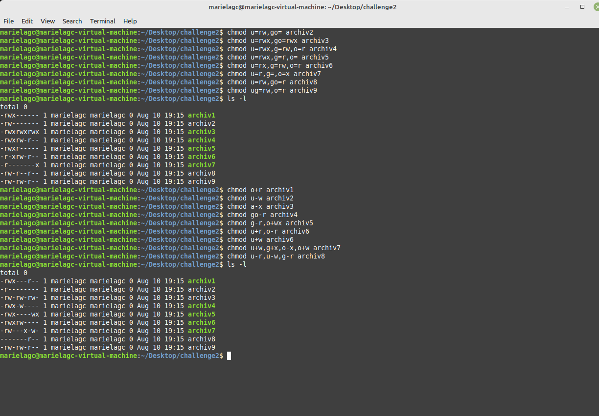

# Reto 2 - Linux - gestión de permisos

## 1
Script para crear los 9 archivos solicitados y quitar los permisos 
[Exercise1.sh](./Exercise1.sh)

## 2.  
Modifica los permisos usando el operador = del chmod, para que queden de la siguiente manera:

Cambio de permisos a los archivos:

## 3.
Modificar los permisos de los archivos anteriores utilizando los operadores + y - del chmod para que queden de la siguiente manera (Los cambios son relativos a los archivos del ejercicio anterior):

Cambio de permisos a los archivos:

## 4. Problema propuesto
Roxs es la líder de un equipo de trabajo para una compañía que realiza Auditorías Externas. Él ha creado un archivo llamado **Lista_Precios** en su directorio **/home.** El archivo es altamente confidencial, pero resulta que existe un alto riesgo de que su archivo sea vulnerado porque otros empleados utilizan su equipo al finalizar su turno. Actualmente, Roxs posee una contraseña segura, pero él necesita resguardar los datos de ese archivo y no desea que nadie más que solamente él tenga acceso al mismo. ¿Qué solución le propondrían como equipo a Roxs?

### Considere lo siguiente para solucionar el problema.
Para proveer una solución apropiada para restringir accesos no autorizados al archivo, se necesita realizar lo siguiente:
1. Identificar las medidas de seguridad a implementarse.
   
   Medidas de seguridad a nivel del archivo **Lista_Precios**

1. Identificar el tipo de usuarios para quienes los permisos >serán cambiados.
   
   Los permisos seran cambiados para el Grupo y Otros

1. Identificar el tipo de permiso que necesita ser cambiado.
 
   Creo que los permisos que deberian ser cambiados son de lectura, escritura y ejecucion. 
   **chmod u+rwx,go-rwx Lista_Precios** 

1. Verificar los permisos de acceso al archivo.